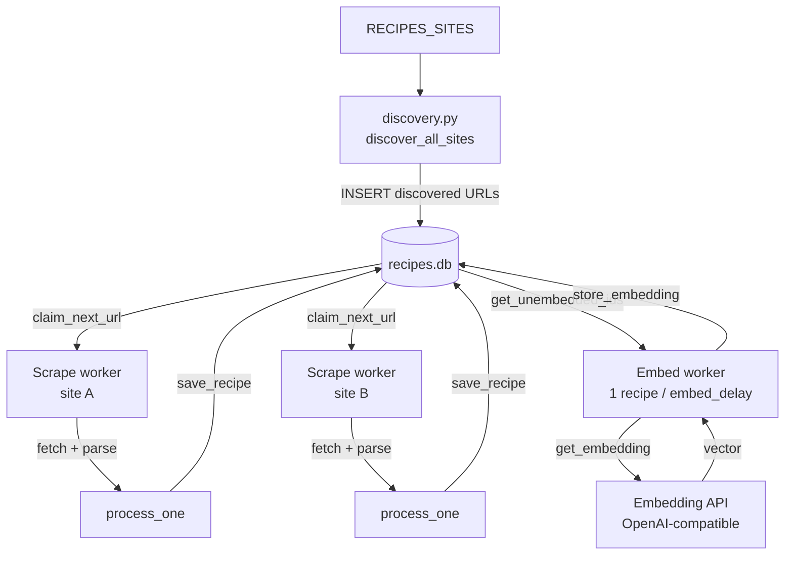
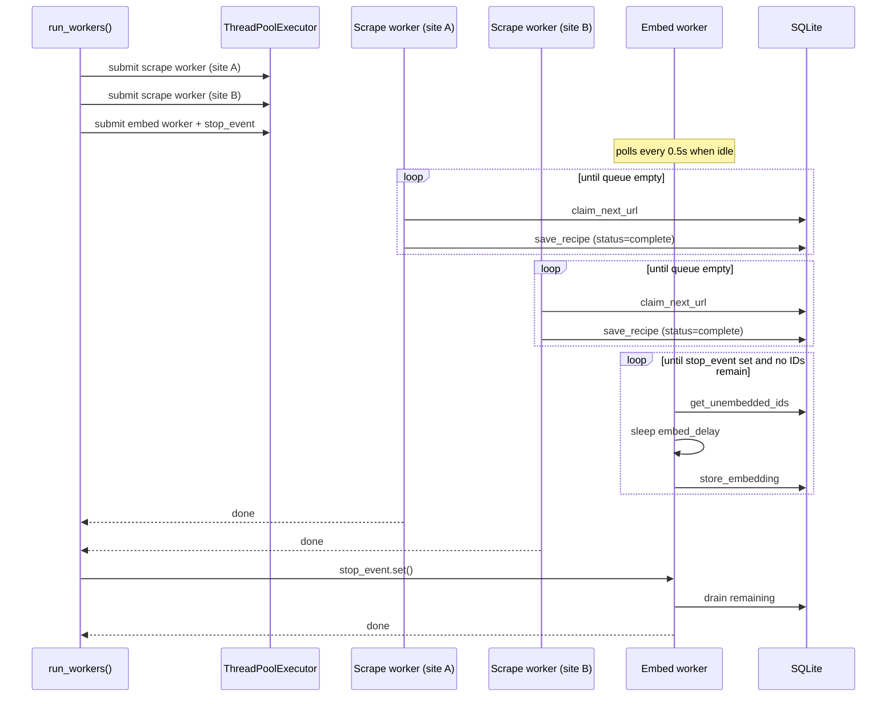
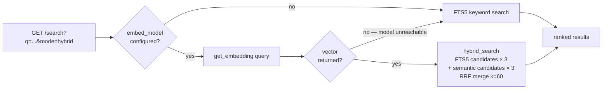

# Recipes

A self-hosted recipe app. Scrape your favourite recipe sites into a local database, then browse and search them from a clean web UI.

---

## Features

- **Site scraping** — discovers recipe URLs from sitemaps, scrapes structured data via [recipe-scrapers](https://github.com/hhursev/recipe-scrapers)
- **Full-text search** — SQLite FTS5 with trigram tokenisation
- **Semantic search** — optional embeddings via any OpenAI-compatible API (e.g. Ollama), stored in SQLite with [sqlite-vec](https://github.com/asg017/sqlite-vec)
- **Hybrid search** — Reciprocal Rank Fusion merges FTS5 and semantic results
- **Collections & favorites** — organize recipes into named collections
- **Single container** — React UI + FastAPI backend + SQLite, no external services required
- **Open WebUI tool** — optional integration for in-chat recipe search

---

## Quick start

```bash
# Copy and edit environment
cp .env.example .env   # or create .env manually — see Configuration below

# Run with Docker Compose
docker compose up -d

# Discover and scrape recipes
docker compose exec recipes recipes scrape

# Check status
docker compose exec recipes recipes stats
```

The web UI is available at `http://localhost:8000`.

---

## Configuration

All settings use the `RECIPES_` prefix and can be set as environment variables or in a `.env` file.

| Variable | Default | Description |
|----------|---------|-------------|
| `RECIPES_DB_PATH` | `recipes.db` | Path to the SQLite database |
| `RECIPES_SITES` | _(empty)_ | Comma-separated hostnames to scrape, e.g. `seriouseats.com,smittenkitchen.com` |
| `RECIPES_RATE_LIMIT_DELAY` | `2.0` | Seconds between requests per site (overridden by `robots.txt` Crawl-delay) |
| `RECIPES_MAX_WORKERS` | `1` | Scraper worker threads |
| `RECIPES_USER_AGENT` | `RecipeBot/1.0 ...` | HTTP User-Agent sent with all requests |
| `RECIPES_URL_FILTER_PATTERN` | `/recipe` | Regex applied to sitemap URLs — only matching paths are scraped |
| `RECIPES_EMBED_URL` | `http://localhost:11434` | Base URL of the embedding API |
| `RECIPES_EMBED_MODEL` | _(empty)_ | Embedding model name — leave empty to disable semantic search |
| `RECIPES_EMBED_DIM` | `768` | Vector dimension — must match the chosen model |
| `RECIPES_EMBED_DELAY` | `1.0` | Seconds between embedding requests (throttle) |

**Semantic search is fully optional.** If `RECIPES_EMBED_MODEL` is not set, the API falls back silently to keyword-only search with zero runtime cost.

### Example `.env` for local development

```dotenv
RECIPES_SITES=www.seriouseats.com,smittenkitchen.com
RECIPES_EMBED_URL=https://your-ollama-host
RECIPES_EMBED_MODEL=text-embedding-nomic-embed-text-v1.5@q4_k_m
RECIPES_EMBED_DIM=768
```

---

## CLI commands

```bash
recipes scrape [--delay FLOAT] [--sitemap URL]   # discover + scrape configured sites
recipes embed  [--reset] [--batch-size N]         # backfill embeddings for existing recipes
recipes serve  [--host HOST] [--port PORT]        # start the API + UI server
recipes stats                                      # print database statistics
```

---

## Search API

`GET /search?q=...`

| Parameter | Default | Description |
|-----------|---------|-------------|
| `q` | required | Search query |
| `mode` | `hybrid` | `keyword` · `semantic` · `hybrid` |
| `limit` | `20` | Results per page (max 100) |
| `offset` | `0` | Pagination offset |
| `author` | | Filter by author (repeatable) |
| `cuisine` | | Filter by cuisine (repeatable) |
| `category` | | Filter by category (repeatable) |
| `site` | | Filter by site hostname (repeatable) |
| `min_time` | | Minimum total time in minutes |
| `max_time` | | Maximum total time in minutes |

When `mode=hybrid` and no embedding model is configured (or the embedding server is unreachable), the API silently degrades to `keyword`.

---

## Architecture

### Scrape + embed pipeline



### Threading model



### Search modes



---

## Open WebUI (optional)

If you use [Open WebUI](https://github.com/open-webui/open-webui), copy `openwebui/recipe_tool.py` into your instance as a **Tool**. Set the `base_url` valve to your recipes server (e.g. `http://recipes:8000`) and optionally set `default_search_mode` to `keyword`, `semantic`, or `hybrid`.

---

## Development

```bash
# Install dependencies
uv sync --group dev

# Run tests
uv run python3 -m pytest tests/

# Start API in dev mode (hot reload)
uv run recipes serve --reload

# Start frontend dev server (proxies API to :8000)
cd ui && npm run dev
```
